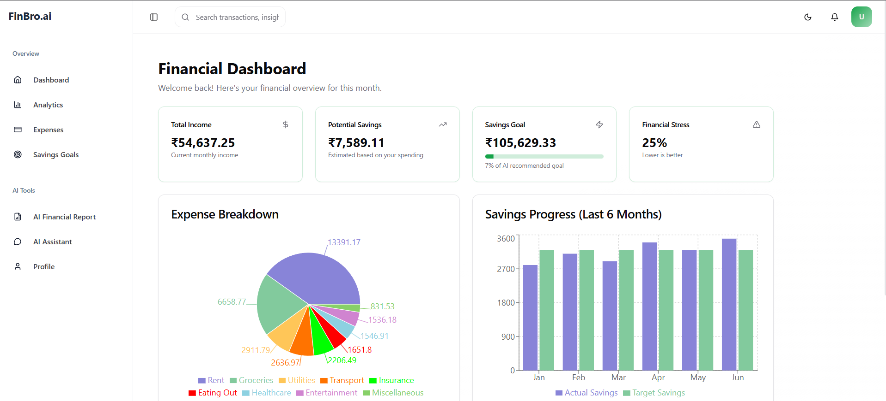
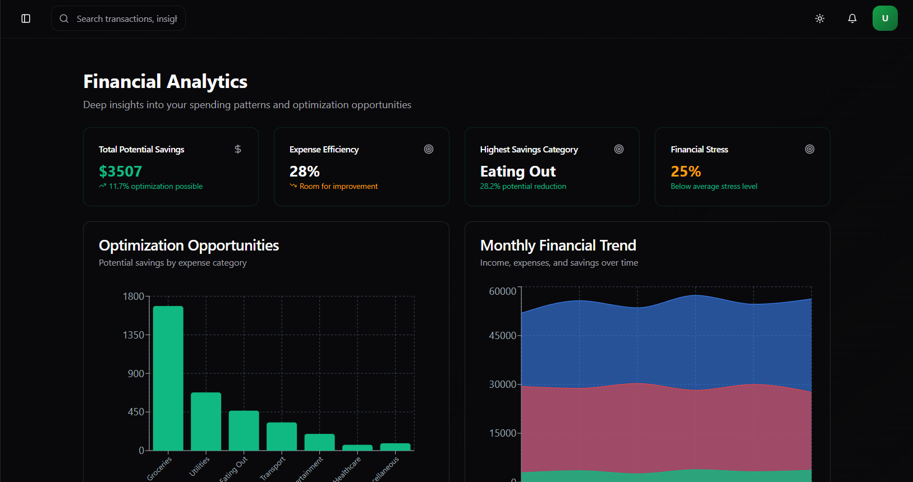
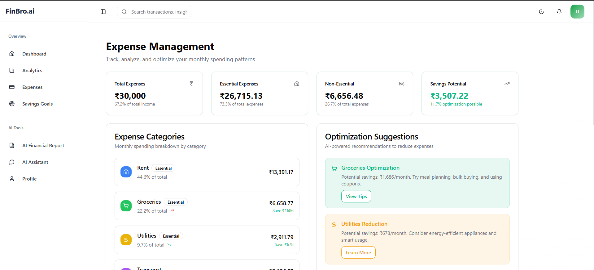
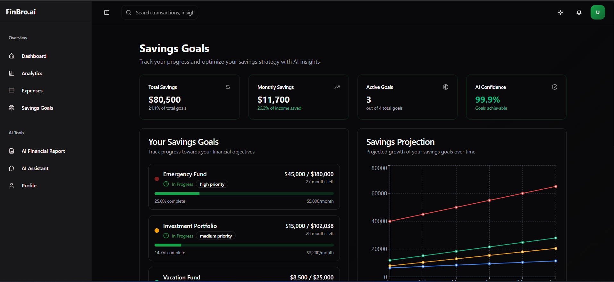
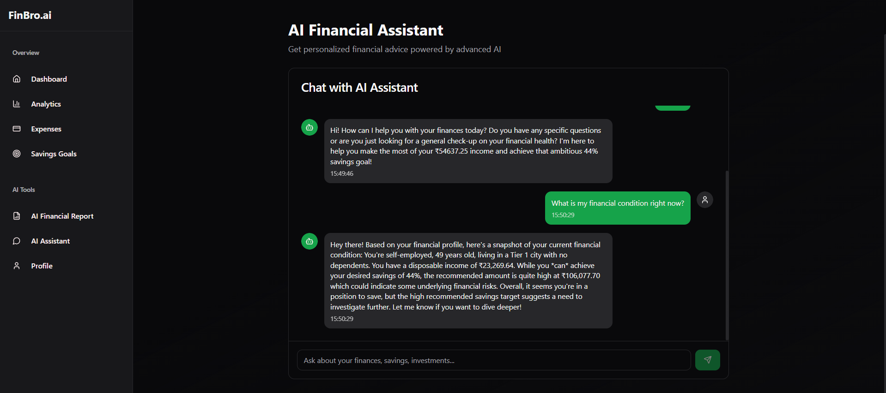
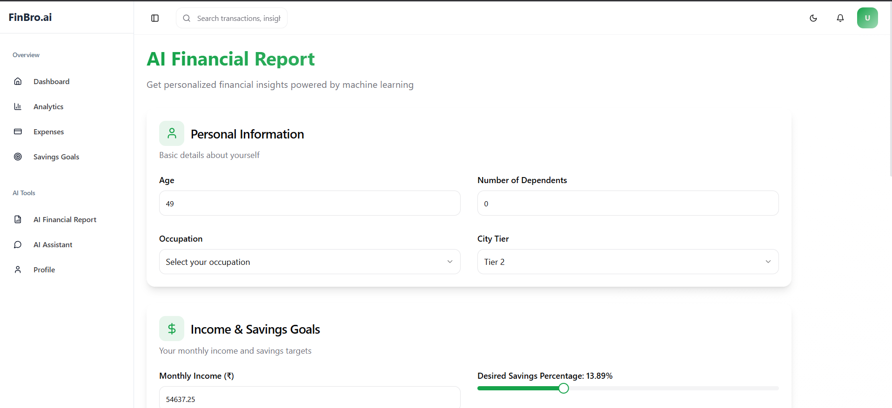
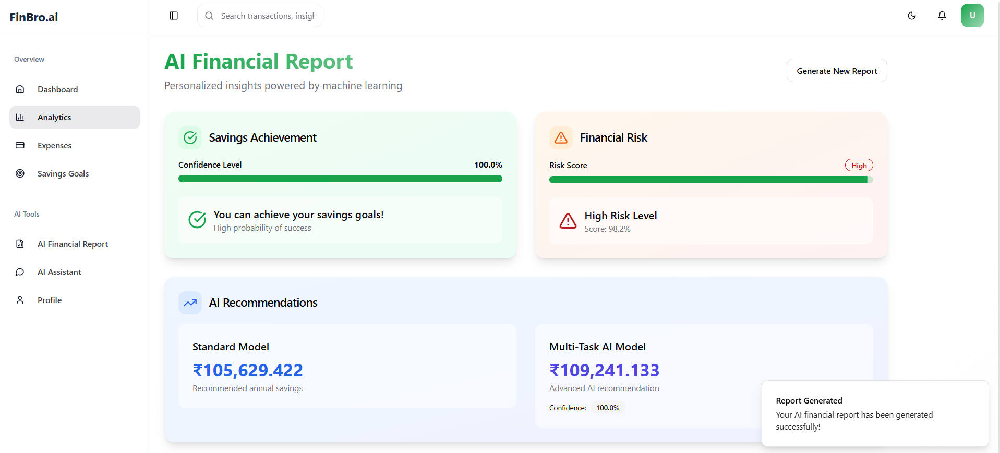

# FinBro.ai - AI-Powered Personal Finance Assistant

## Team Lost_Not_Found

-   **Team Leader**: Janhavi Chavan
-   **Members**:
    -   Anchal Tandekar
    -   Rejwanul Hoque

## Project Overview

FinBro.ai is an advanced financial management platform that leverages cutting-edge machine learning models and Google's Gemini AI to provide personalized financial guidance. By analyzing over 26 financial parameters, including income, expenses, and spending patterns, our system offers accurate savings predictions, risk assessments, and tailored financial advice through an intuitive chat interface.

<p align="center">
  
</p>

## 🌟 Key Features

### 1. AI Financial Analysis Models

-   **Savings Achievement Prediction**: Advanced ML model analyzing 26+ parameters to predict savings goal attainment
-   **Optimal Savings Calculator**: Data-driven recommendations for monthly savings targets
-   **Risk Assessment**: Sophisticated financial risk profiling using multi-task learning
-   **Confidence Scoring**: Precise confidence metrics for all predictions

<p align="center">
  
</p>

### 2. Gemini-Powered AI Assistant

-   **Personalized Financial Advisor**: Processes 26+ financial parameters
-   **Smart Insights**: Real-time, context-aware financial advice
-   **Natural Interaction**: Conversational interface with 100-word digestible responses
-   **Data-Backed Suggestions**: Recommendations based on your financial profile

<p align="center">
  
</p>

### 3. Smart Savings Tracker

-   **Goal Setting & Monitoring**: Visual tracking of savings objectives
-   **Progress Analytics**: Detailed breakdowns of saving patterns
-   **AI-Powered Recommendations**: Personalized tips to optimize savings

<p align="center">
  
</p>

### 4. Interactive Chat Interface

-   **Real-time Assistance**: Instant responses to financial queries
-   **Contextual Understanding**: AI that remembers your financial context
-   **Actionable Insights**: Practical advice you can implement immediately

<p align="center">
  
</p>

### 5. Financial Report Generator

-   **Comprehensive Analysis**: Detailed breakdown of your financial health
-   **Risk Assessment**: Visual representation of financial risks
-   **Future Projections**: AI-powered financial forecasting

<p align="center">
  
</p>

### 6. AI-Powered Results Dashboard

-   **Prediction Results**: Visual representation of ML model predictions
-   **Confidence Metrics**: Clear display of prediction confidence levels
-   **Risk Assessment Scores**: Comprehensive financial risk analysis
-   **Savings Recommendations**: Personalized savings amount suggestions

<p align="center">
  
</p>

## 🛠️ Technology Stack

-   **Backend**: Flask, TensorFlow, Gemini AI
-   **Frontend**: React, TypeScript, Tailwind CSS
-   **ML Models**: Attention-based Neural Networks
-   **API**: RESTful architecture

## 📂 Project Structure

```
Team-lost_not_found/
│
├── backend/
│   ├── app.py           # Flask API server
│   ├── chatBot.py       # Gemini chatbot integration
│   └── readme.md        # API documentation
│
├── model/
│   ├── feature_info.json
│   ├── trained_model/
│   │   ├── best_savings_model.keras
│   │   ├── best_amount_model.keras
│   │   └── best_multi_task_model.keras
│   └── ... (notebooks, scripts)
│
├── frontend/
│   ├── src/
│   │   ├── components/
│   │   ├── pages/
│   │   └── services/
│   └── package.json
│
└── data/
    └── processed_financial_data.csv
```

## 🚀 Getting Started

### Prerequisites

-   Python 3.8+
-   Node.js & npm/pnpm
-   Gemini API key

### Installation

1. **Clone the repository**

```bash
git clone https://github.com/Janhaviiiiiiii/Team-lost_not_found.git
cd Team-lost_not_found
```

2. **Set up frontend**

```bash
cd frontend
pnpm install  # or npm install
cd ..
```

3. **Install Python dependencies**

```bash
pip install -r requirements.txt
```

4. **Configure environment**
   Create a `.env` file in the backend directory:

```env
GEMINI_API_KEY=your_api_key_here
```

5. **Run the application**

```bash
python run.py
```

The application will be available at `http://localhost:5000`

## 🔄 API Endpoints

### 1. Predictions API

```bash
POST /predict
Content-Type: application/json

{
  "Income": 44637.25,
  "Age": 49,
  "Dependents": 0,
  ...
}
```

### 2. Chat API

```bash
POST /chat
Content-Type: application/json

{
  "message": "How can I improve my savings?"
}
```

## 👥 Team Lost Not Found

-   **Team Leader**: Janhavi Chavan
-   **Members**:
    -   Anchal Tandekar
    -   Rejwanul Hoque

## 📋 Future Roadmap

-   Advanced portfolio management features
-   Integration with financial institutions
-   Mobile application development
-   Enhanced ML model accuracy
-   Real-time financial alerts

## 📝 License

This project is intended for educational and prototype purposes only.

## 🤝 Contributing

We welcome contributions! Please feel free to submit a Pull Request.
