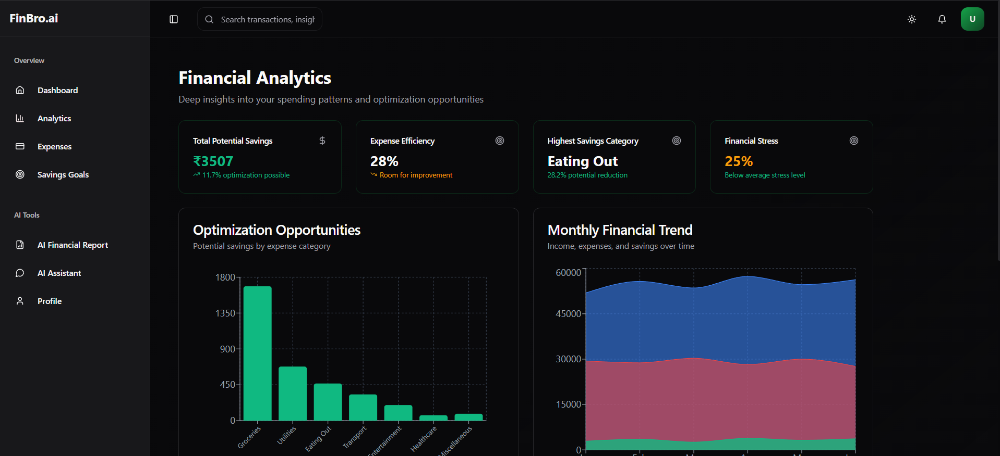
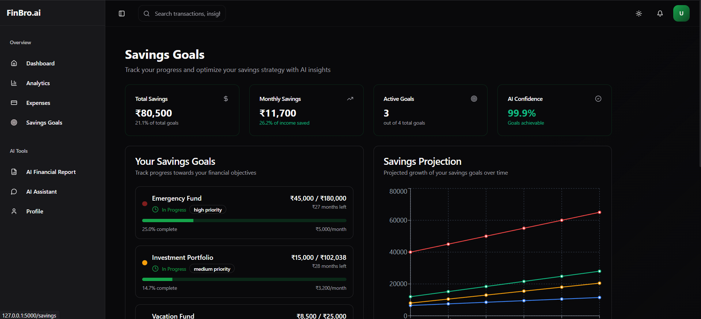

# FinBro.ai - AI-Powered Personal Finance Assistant

## Team Lost_Not_Found

-   **Team Leader**: Janhavi Chavan
-   **Members**:
    -   Anchal Tandekar
    -   Rejwanul Hoque

## Project Overview

FinBro.ai is an advanced financial management platform that leverages cutting-edge machine learning models and Google's Gemini AI to provide personalized financial guidance. By analyzing over 26 financial parameters, including income, expenses, and spending patterns, our system offers accurate savings predictions, risk assessments, and tailored financial advice through an intuitive chat interface.

## 🌟 Key Features

### 1. Smart Financial Dashboard

-   **Financial Overview**: Comprehensive view of income, expenses, and savings
-   **ML-Powered Insights**: Real-time AI predictions for savings goals and risk assessment
-   **Key Metrics**: Essential financial indicators including savings rate and expense ratios
-   **Quick Stats**: Visual breakdowns of financial health metrics

<p align="center">
  
</p>

### 2. Advanced Analytics

-   **Savings Potential**: Detailed analysis of potential savings across categories
-   **Expense Efficiency**: Smart scoring of your spending patterns
-   **Financial Health Metrics**: Comprehensive scorecard with target comparisons
-   **Trend Analysis**: Monthly financial patterns and projections

<p align="center">
  
</p>

### 3. Expense Management

-   **Category Breakdown**: Detailed categorization of monthly expenses
-   **Essential vs Non-Essential**: Smart categorization of spending
-   **Savings Opportunities**: AI-identified areas for potential savings
-   **Spending Insights**: Personalized recommendations for expense optimization

<p align="center">
  
</p>

### 4. Smart Savings Tracker

-   **Goal Progress**: Real-time tracking of savings objectives
-   **AI Confidence Scoring**: ML-powered assessment of goal achievability
-   **Monthly Projections**: Predicted savings trajectories
-   **Personalized Recommendations**: AI-driven savings optimization strategies

<p align="center">
  
</p>

### 5. Gemini-Powered AI Assistant

-   **Natural Language Interface**: Conversational financial guidance
-   **Contextual Awareness**: Understands your financial profile
-   **Real-time Insights**: Instant responses to financial queries
-   **Personalized Advice**: Custom recommendations based on your data

<p align="center">
  
</p>

### 6. AI Financial Report Generator

-   **Multi-Model Analysis**: Combines multiple ML models for comprehensive assessment
-   **Risk Profiling**: Advanced financial risk assessment
-   **Savings Achievement Prediction**: ML-powered savings goal analysis
-   **Custom Recommendations**: Tailored financial advice based on 26+ parameters

<p align="center">
  
</p>

### 7. AI Prediction Results

-   **Comprehensive Results**: Detailed breakdown of ML model predictions
-   **Confidence Metrics**: Clear visualization of prediction reliability
-   **Risk Assessment**: In-depth analysis of financial risk factors
-   **Action Items**: Specific recommendations for financial improvement

<p align="center">
  
</p>

## 🛠️ Technology Stack

-   **Backend**: Flask, TensorFlow, Gemini AI
-   **Frontend**: React, TypeScript, Tailwind CSS
-   **ML Models**: Attention-based Neural Networks
-   **API**: RESTful architecture

## 📂 Project Structure

```
Team-lost_not_found/
│
├── backend/
│   ├── app.py           # Flask API server
│   ├── chatBot.py       # Gemini chatbot integration
│   └── readme.md        # API documentation
│
├── model/
│   ├── feature_info.json
│   ├── trained_model/
│   │   ├── best_savings_model.keras
│   │   ├── best_amount_model.keras
│   │   └── best_multi_task_model.keras
│   └── ... (notebooks, scripts)
│
├── frontend/
│   ├── src/
│   │   ├── components/
│   │   ├── pages/
│   │   └── services/
│   └── package.json
│
└── data/
    └── processed_financial_data.csv
```

## 🚀 Getting Started

### Prerequisites

-   Python 3.8+
-   Node.js & npm/pnpm
-   Gemini API key

### Installation

1. **Clone the repository**

```bash
git clone https://github.com/Janhaviiiiiiii/Team-lost_not_found.git
cd Team-lost_not_found
```

2. **Set up frontend**

```bash
cd frontend
pnpm install  # or npm install
cd ..
```

3. **Install Python dependencies**

```bash
pip install -r requirements.txt
```

4. **Configure environment**
   Create a `.env` file in the backend directory:

```env
GEMINI_API_KEY=your_api_key_here
```

5. **Run the application**

```bash
python run.py
```

The application will be available at `http://localhost:5000`

## 🔄 API Endpoints

### 1. Predictions API

```bash
POST /predict
Content-Type: application/json

{
  "Income": 44637.25,
  "Age": 49,
  "Dependents": 0,
  ...
}
```

### 2. Chat API

```bash
POST /chat
Content-Type: application/json

{
  "message": "How can I improve my savings?"
}
```

## 👥 Team Lost Not Found

-   **Team Leader**: Janhavi Chavan
-   **Members**:
    -   Anchal Tandekar
    -   Rejwanul Hoque

## 📋 Future Roadmap

-   Advanced portfolio management features
-   Integration with financial institutions
-   Mobile application development
-   Enhanced ML model accuracy
-   Real-time financial alerts

## 📝 License

This project is intended for educational and prototype purposes only.

## 🤝 Contributing

We welcome contributions! Please feel free to submit a Pull Request.
